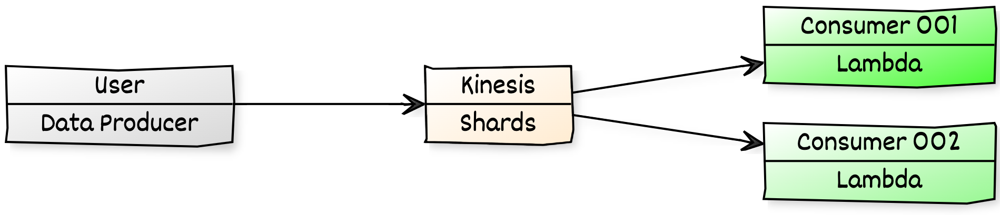

# Process Streaming Data using Kinesis

Sample project to ingest data into kinesis shard and read using different lambda, as you will do in a fan-out architecture.

  

  Follow this article in **[Youtube](https://www.youtube.com/c/ValaxyTechnologies)**

1. ## 🧰 Prerequisites

    This demo, instructions, scripts and cloudformation template is designed to be run in `us-east-1`. With few modifications you can try it out in other regions as well(_Not covered here_).

    - AWS CLI pre-configured - [Get help here](https://youtu.be/TPyyfmQte0U)
    - AWS CDK Installed & Configured - [Get help here](https://www.youtube.com/watch?v=MKwxpszw0Rc)
    - Python Packages, _Change the below commands to suit your OS, the following is written for amzn linux 2_
        - Python3 - `yum install -y python3`
        - Python Pip - `yum install -y python-pip`
        - Virtualenv - `pip3 install virtualenv`

1. ## ⚙️ Setting up the environment

    - Get the application code

        ```bash
        git clone https://github.com/miztiik/stream-data-processor.git
        cd stream-data-processor
        ```

1. ## 🚀 Resource Deployment using AWS CDK

    The cdk stack provided in the repo will create the following resources,
    - VPC with public & private subnets, route tables, security group and nacl.
    - EC2 Instance that ingests data into the kinesis shards
        - Data comes from covid19 patients list <sup>#Reference</sup>
    - Lambda function[s] as kinesis consumer

    ```bash
    # If you DONT have cdk installed
    npm install -g aws-cdk

    # Make sure you in root directory
    python3 -m venv .env
    source .env/bin/activate
    pip3 install -r requirements.txt
    ```

    The very first time you deploy an AWS CDK app into an environment _(account/region)_, you’ll need to install a `bootstrap stack`, Otherwise just go aheadand   deploy using `cdk deploy`.

    ```bash
    cdk bootstrap
    cdk deploy stream-data-processor
    # Follow onscreen prompts
    ```

1. ## 🔬 Testing the solution

    The _Outputs_ section of the Clouformation template/service has the required information.

    - Connect to the EC2 instance using Session Manager - [Get help here](https://www.youtube.com/watch?v=-ASMtZBrx-k)
        - Update the `app_stacks/bootstrap_scripts/constants.py` with desired values
        - Run the `kinesis_producer.py`

        ```bash
        cd stream-data-processor/app_stacks/bootstrap_scripts/
        python3 kinesis_producer.py
        ```

1. ## 🧹 CleanUp

    If you want to destroy all the resources created by the stack, Execute the below command to delete the stack, or _you can delete the stack from console as well_

    - Resources created during [deployment](#🚀-resource-deployment-using-aws-cdk)
    - Delete CloudWatch Lambda LogGroups
    - _Any other custom resources, you have created for this demo_

    ```bash
    # Delete from cdk
    cdk destroy

    # Delete the CF Stack, If you used cloudformation to deploy the stack.
    aws cloudformation delete-stack \
        --stack-name "MiztiikAutomationStack" \
        --region "${AWS_REGION}"
    ```

    This is not an exhaustive list, please carry out other necessary steps as maybe applicable to your needs.

## 👋 Buy me a coffee

[Buy me](https://paypal.me/valaxy) a coffee ☕, _or_ You can reach out to get more details through [here](https://youtube.com/c/valaxytechnologies/about).

### 📚 References

1. [AWS Blog](https://dataprocessing.wildrydes.com/streaming-data.html)
1. [Kinesis Security - IAM](https://docs.aws.amazon.com/streams/latest/dev/controlling-access.html)

### 🏷️ Metadata

**Level**: 300
