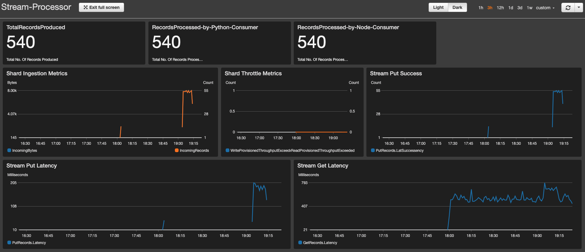

# Process Streaming Data using Kinesis

Real-time delivery of data and insights enables businesses to pivot quickly in response to changes in demand, user engagement, and infrastructure events, among many others. Amazon Kinesis offers a managed service that lets you focus on building your applications, rather than managing infrastructure. Scalability is provided out-of-the-box, allowing you to ingest and process gigabytes of streaming data per second.

Kinesis Data Stream consists one or many shards. Each data stream is composed of one or more shards that act as units of capacity. Shards make it easy for you to design and scale a streaming pipeline by providing a predefined write and read capacity. As workloads grow, an application may read or write to a shard at a rate that exceeds its capacity, creating a hot shard and requiring you to add capacity quickly. Shards also enable you to parallelize the processing of large datasets and compute results quickly.

This project will show how to setup a kinesis stream[single shard] and setup a `producer` to ingest data into kinesis shard. A `consumer` that will read using different lambda functions, as you will do in a pub-sub architecture.

  

  Follow this article in **[Youtube](https://www.youtube.com/c/ValaxyTechnologies)**

1. ## 🧰 Prerequisites

    This demo, instructions, scripts and cloudformation template is designed to be run in `us-east-1`. With few modifications you can try it out in other regions as well(_Not covered here_).

    - AWS CLI pre-configured - [Get help here](https://youtu.be/TPyyfmQte0U)
    - AWS CDK Installed & Configured - [Get help here](https://www.youtube.com/watch?v=MKwxpszw0Rc)
    - Python Packages, _Change the below commands to suit your OS, the following is written for amzn linux 2_
        - Python3 - `yum install -y python3`
        - Python Pip - `yum install -y python-pip`
        - Virtualenv - `pip3 install virtualenv`

1. ## ⚙️ Setting up the environment

    - Get the application code

        ```bash
        git clone https://github.com/miztiik/stream-data-processor.git
        cd stream-data-processor
        ```

1. ## 🚀 Resource Deployment using AWS CDK

    The cdk stack provided in the repo will create the following resources,
    - VPC with public & private subnets, route tables, security group and nacl.
    - EC2 Instance that ingests data into the kinesis shards
        - Data comes from covid19 patients list <sup>[Ref](#-references)</sup>
    - Lambda function[s] as kinesis consumer

    ```bash
    # If you DONT have cdk installed
    npm install -g aws-cdk

    # Make sure you in root directory
    python3 -m venv .env
    source .env/bin/activate
    pip3 install -r requirements.txt
    ```

    The very first time you deploy an AWS CDK app into an environment _(account/region)_, you’ll need to install a `bootstrap stack`, Otherwise just go aheadand   deploy using `cdk deploy`.

    ```bash
    cdk bootstrap
    cdk deploy stream-data-producer-monitor-stack
    # Follow onscreen prompts
    ```

1. ## 🔬 Testing the solution

    The _Outputs_ section of the Clouformation template/service has the required information.

    - Connect to the EC2 instance using Session Manager - [Get help here](https://www.youtube.com/watch?v=-ASMtZBrx-k)
        - Navigate to `/var/stream-data-processor`
        - Update the `stream_data_producer/bootstrap_scripts/constants.py` with desired values
        - Run the `kinesis_producer.py`. This should start sending message to your kinesis stream. This is in addition to the data that was already pushed to the stream during the instance bootup sequence.

        ```bash
        cd stream-data-processor/stream_data_producer/bootstrap_scripts/
        python3 kinesis_producer.py
        ```

    - Goto your cloudwatch dashboard and open the newly created `stream-processor` dashboard, You should be able to see something like this,

        

    Key take away,
    1. Now you have learnt how to setup kinesis data streams,
        - Setup Shards
    1. Setup Kinesis producers using boto3 - _Check `kinesis_producer.py` to learn more.
    1. Setup Kinesis consumers, Two lambda, in `python` & `nodejs`
    1. Setup dynamic dashboards based logs, metrics
    1. Performance Analysis - _Some more stats [here](performance_stats.md)_

1. ## 🧹 CleanUp

    If you want to destroy all the resources created by the stack, Execute the below command to delete the stack, or _you can delete the stack from console as well_

    - Resources created during [deployment](#-resource-deployment-using-aws-cdk)
    - Delete CloudWatch Lambda LogGroups
    - _Any other custom resources, you have created for this demo_

    ```bash
    # Delete from cdk
    cdk destroy

    # Delete the CF Stack, If you used cloudformation to deploy the stack.
    aws cloudformation delete-stack \
        --stack-name "MiztiikAutomationStack" \
        --region "${AWS_REGION}"
    ```

    This is not an exhaustive list, please carry out other necessary steps as maybe applicable to your needs.

## 📝 Next Steps - TODO

- Create two shards in a stream
- Create `Hot Shards`<sup>[Ref](#-references)</sup>

## 👋 Buy me a coffee

[Buy me](https://paypal.me/valaxy) a coffee ☕, _or_ You can reach out to get more details through [here](https://youtube.com/c/valaxytechnologies/about).

### 📚 References

1. [AWS Blog](https://dataprocessing.wildrydes.com/streaming-data.html)

1. [Kinesis Security - IAM](https://docs.aws.amazon.com/streams/latest/dev/controlling-access.html)
1. [Kinesis Consumers](https://docs.aws.amazon.com/lambda/latest/dg/with-kinesis-create-package.html)
1. [Metric Filters](https://docs.aws.amazon.com/AmazonCloudWatch/latest/logs/FilterAndPatternSyntax.html)
1. [Scale Kinesis- Preempt Hot Shards](https://aws.amazon.com/blogs/big-data/under-the-hood-scaling-your-kinesis-data-streams)

### 🏷️ Metadata

**Level**: 300
