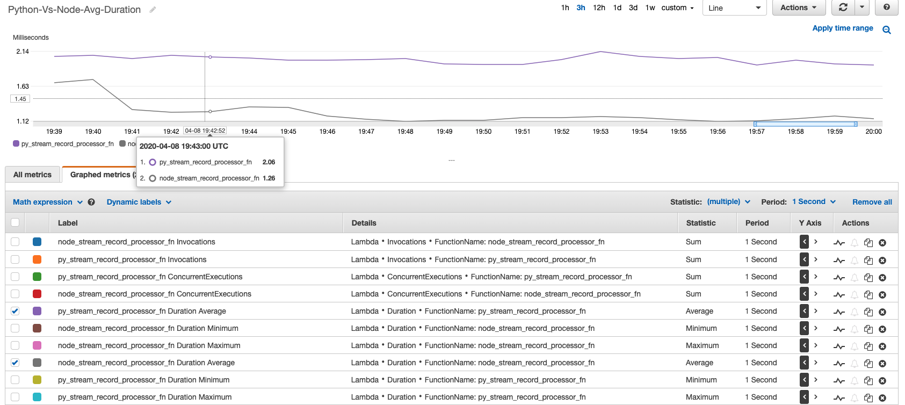

# Performance Metrics

For the consumer, we are using two lambda functions to do the same quanta of work. The functions are written in `python` and `nodejs`. _Although no where close to an ideal test_, just a **fun** way to see performance of these run times.

## Lambda Runtimes Python Vs Nodejs

### Duration across Invocations: Average

### Duration across Invocations: Minimum

_Note the label in the graph is incorrect, too lazy to fix it_

### Duration across Invocations: Maximum

## 👋 Buy me a coffee

[Buy me](https://paypal.me/valaxy) a coffee ☕, _or_ You can reach out to get more details through [here](https://youtube.com/c/valaxytechnologies/about).

### 🏷️ Metadata

**Level**: 300
